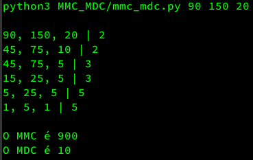
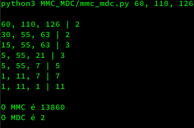

# Matemática

### Numeros_primos
Nesse exemplo:
```bash
python3 Numeros_primos/numeros_primos.py 10
```
O script percorre os números de 2 até o número especificado e verifica quais números são primos. No exemplo, ele percorre de 2 a 10 e a saída mostrará que 2, 3, 5 e 7 são números primos, ou seja, existem esses números primos no intervalo de 2 a 10.


Em outro exemplo:
```bash
python3 Numeros_primos/numeros_primos.py 1000
```
O script começa em 2 e verifica os números primos existentes até chegar ao número 1000.


### MMC_MDC
Neste exemplo, usamos Python para encontrar o MMC (Mínimo Múltiplo Comum) e o MDC (Máximo Divisor Comum) de 90, 150 e 20 e exibir o cálculo e o resultado:
```bash
python3 MMC_MDC/mmc_mdc.py 90 150 20
```

 

E em outro exemplo, usamos Python para encontrar o MMC e o MDC de 60, 110 e 126:
```bash
python3 MMC/mmc.py MMC_MDC/mmc_mdc.py 60 110 126
```

 